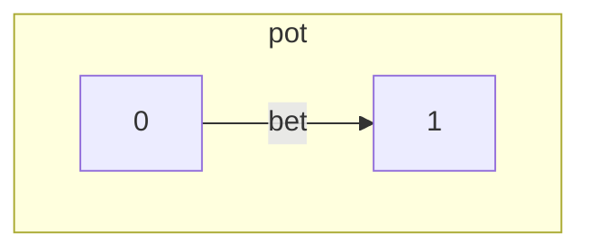
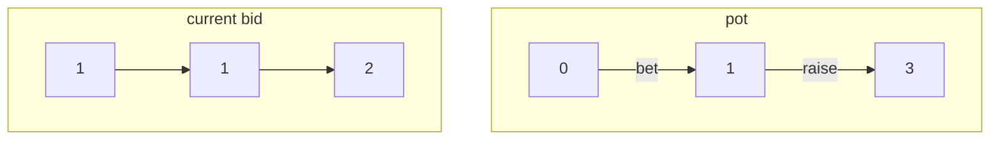
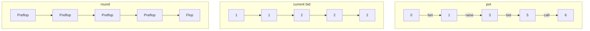
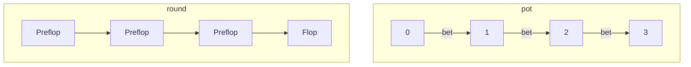
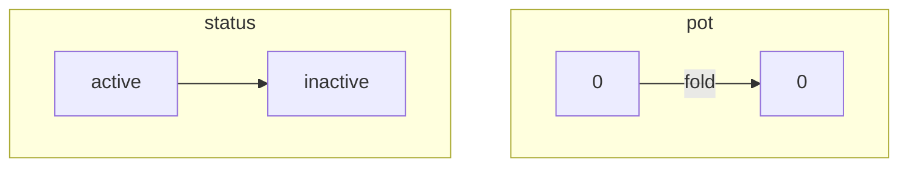
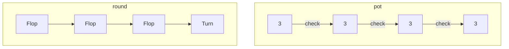
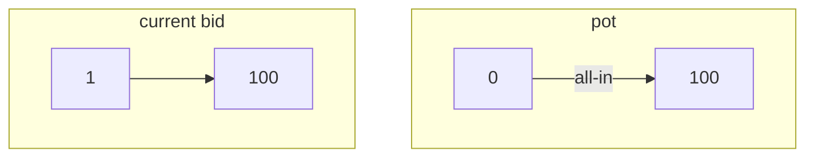
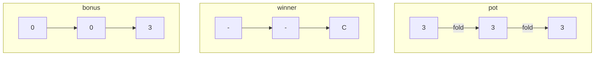

### SbE

#### rule

1. 每局游戏参与人数为`2-10`人
2. 每局游戏会有一个Dealer，即发牌员，Dealer左侧依次是小盲位，大盲位
3. Dealer会根据顺时针方向从小盲位开始依次给大家分发2张盖牌
4. 游戏共4轮，分别为`Preflop`、`Flop`、`Turn`、`River`
5. 玩家在每轮可进行下注，跟注，加注，弃牌的操作
6. 游戏开始时，需要大小盲注依次下盲注，一般大盲注下注金额为小盲注下注金额2倍
7. 玩家下注金额应不低于场上最高的下注金额
8. 玩家加注即在下注后继续增加底池金额，一般加注金额与跟下注金额相同
9. 加注之前的玩家在轮次结束后需要跟注或弃牌方可进入下一轮
10. 当所有玩家下注金额一致可进入下一轮
11. 玩家弃牌后放弃已下注的金额并离场
12. `Flop` `Turn` `River`轮次首名玩家增加过牌操作，即不下注，若上名玩家选择过牌，则当前玩家也可选择过牌
13. 玩家在游戏结束前`All-in`，后续不会进行任何操作，可参与后续的比牌
14. 当场上剩余一名玩家，则该玩家赢取所有玩家已下注的金额
15. `River`轮次后，场上仍有多名玩家，需进行摊牌操作，牌面最大的玩家赢取所有玩家已下注的金额
16. `River`轮次后，多名玩家获胜，将平分下注的金额
17. `All-in`玩家获胜只能获取`All-in`时的底池金额，其他玩家中牌面最大的玩家获取剩下的底池金额

#### example

游戏最小赌注为1， 当玩家A下注，底池金额为1

游戏最小赌注为1，玩家A下注，玩家B加注1，底池金额为3，当前赌注为2

游戏最小赌注为1，当前轮次为`Preflop`，底池金额为0

 玩家A下注，玩家B加注1，玩家C下注，当前轮次为`Preflop`，当前赌注为2，底池金额为5

玩家A跟注，轮次为`Flop`，当前赌注为2，底池金额为6

游戏最小赌注为1，当前轮次为`Preflop`，底池金额为0

玩家A下注，玩家B下注，玩家C下注，游戏进入下一轮，轮次为`Flop`，底池金额为3

玩家A状态为`active`，底池金额为0，玩家A弃牌，状态为`inactive`，底池金额为0

`Flop`轮次，底池金额为3，玩家A过牌，玩家B过牌，玩家C过牌，此时轮次为`Turn`，底池金额为3

`Preflop`轮次，底池金额为0，当前赌注为1，玩家A`All-in`，底池金额为100，当前赌注为100

`Flop`轮次，底池金额为3，玩家A弃牌，玩家B弃牌，C赢得金额3

